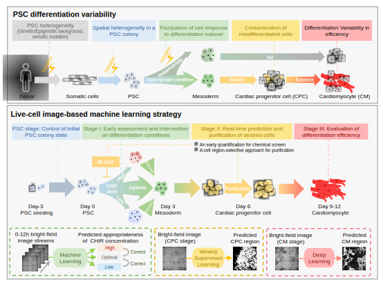

# A live-cell image-based machine learning strategy for reducing variability in PSC differentiation systems

Code and data accompanying

Yang, X., Chen, D., Sun, Q. *et al.* A live-cell image-based machine learning strategy for reducing variability in PSC differentiation systems. *Cell Discov* **9**, 53 (2023). https://doi.org/10.1038/s41421-023-00543-1

## Requirements

* MATLAB (R2020a)
* Python 3.6, with packages:
  * pytorch 1.9.0
  * numpy, scipy, scikit-learn, scikit-image, opencv-python, matplotlib
* Jupyter Notebook / JupyterLab

## Deep Learning-based CM recognition and efficiency evaluation

We first applied deep learning to predict the fluorescent image of cardiac troponin T (cTnT) from the bright-field images at the CM stage (stage III). We adopted the pix2pix model  for the bright-field-to-fluorescence image transformation task. Through end-to-end training with paired bright-field and true fluorescence images, the model can capture the multi-scale features of CMs, which enables it to generate fluorescence predictions for new bright-field images. 

Please refer to [stage_III/README.md](stage_III/README.md) for more details.

## Weakly supervised learning-based CM-committed CPC recognition and efficiency prediction

The success of CM recognition demonstrated that the successfully differentiated cells contained distinguishable features, which encouraged us to study the image features of cells in the CPC stage. We explored using weakly supervised learning for recognizing CM-committed CPCs based solely on image-level categorical labels (*i.e.*, without the pixel-level labels used to train the pix2pix model for CM recognition).

We used a two-stage design in our weakly supervised learning model for CPC recognition. First, a classification network, ResNeSt-101 was trained with bright-field image patches from day 6 labeled as positive or negative. Next, the bright-field images from the test set were passed to the trained network, and Gradient-weighted Class Activation Mapping (Grad-CAM) was used to generate heatmaps that could highlight the regions contributing most to the network’s inference. The prediction of CPC regions was therefore derived from the highlighted regions in the heatmaps.

Please refer to [stage_II/README.md](stage_II/README.md) for more details. 

## Machine learning-based early assessment of CHIR doses
The cell recognition in CM and CPC stages (stage III and II) have solved the problem of misdifferentiated cell contamination. We next turned to stage I, an early stage of differentiation, and expected those misdifferentiated cells could be corrected to the right trajectory based on bright-field images. 

To this end, we built a logistic regression classifier on handcrafted features, to classify 0-12h bright-field image streams into "low", "optimal", and "high" CHIR concentration group (under a selected CHIR duration). With the ML models, wells predicted as low or high concentration can be rescued by adjusting their CHIR doses to further improve differentiation efficiency.

Please refer to [stage_I/README.md](stage_I/README.md) for more details.

## Controlling the initial state of PSC colonies

We found that there still remained cells failing to differentiate to CMs even under the optimal CHIR dose, which motivated us to investigate the relation between differentiating cell heterogeneity and CM induction capability within a well. Tracking image streams in reverse order, back to the PSC stage, we found that cells migrated from the periphery of the initial PSC colonies beginning at 24h (after differentiation was initiated), and almost filled the cell-free area by 72h, eventually yielding CMs, whereas cells located in the center of large PSC colonies more frequently failed to fully differentiate. The trend in spatially variable differentiation within PSC colonies led us to hypothesize that colony morphology could contribute to the differentiation process. 

We therefore built a ML model to determine the optimal PSC colony shape that led to the high differentiation efficiency. The random forest model was applied to predict the final differentiation efficiency  from handcrafted features of bright-field images at the PSC stage. The trained ML model can monitor PSC colonies after passage in real-time to identify the most conducive starting point for differentiation. 

Please refer to [./colony_control/README.md](./colony_control/README.md) for more details.

## **Applying the image-based strategy to nephric and hepatic differentiation** 

Our proof-of-concept studies in image-based ML-guided cardiac differentiation encouraged us to transfer our strategy to modulate other PSC differentiation processes, such as into nephric cells and hepatic cells, which are also valuable for cell-based therapy or drug toxicity evaluation.

**Nephric differentiation**. In the early differentiation process of PSCs to kidney organoids, the optimal CHIR concentration was essential to high differentiation efficiency but fluctuated among batches. We then built a logistic regression model to classify the day 4 bright-field images into "low", "optimal", and "high" CHIR concentration groups using SIFT features.  Please refer to [nephric_differentiation/README.md](nephric_differentiation/README.md) for more details.

**Hepatic differentiation**. Low reproducibility in differentiation efficiency across batches is also a critical challenge for hepatic differentiation systems. We therefore explored the application of ML for non-invasively recognizing definitive endoderm (DE) regions (72h, stage I of hepatic differentiation) in bright-field images. We then trained the weakly supervised learning model on DE stage bright-field images with purely categorical labels (*i.e*., “positive” or “negative”, according to the proportion of SOX17+ cell region). The code used here was the same as that for CPC recognition. However, the image dataset is also extreme large (~10GB), so please contact the corresponding author for the data if you want to reproduce the results in our paper.

## Citation

If you use the code or data from our paper, please cite:

Yang, X., Chen, D., Sun, Q. *et al.* A live-cell image-based machine learning strategy for reducing variability in PSC differentiation systems. *Cell Discov* **9**, 53 (2023). https://doi.org/10.1038/s41421-023-00543-1

