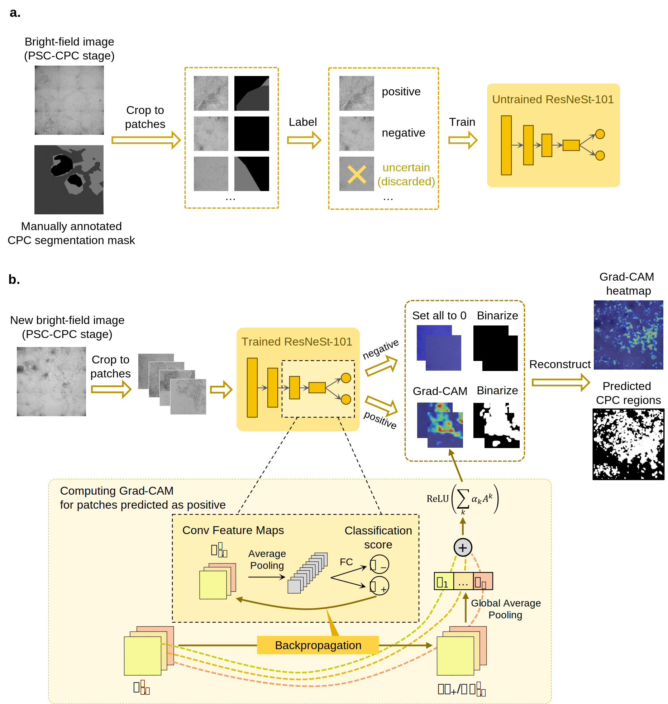

# Weakly	supervised	learning-based CPC recognition 

Here we provide our custom code for the weakly supervised learning-based CPC recognition at the PSC-CPC stage (stage II). The implementation of ResNeSt and Grad-CAM was borrowed from https://github.com/MachineLP/PyTorch_image_classifier/tree/master/qdnet and https://github.com/jacobgil/pytorch-grad-cam, respectively.

At the training stage, the ResNeSt-101 network learns to classify bright-field image patches as "positive" or "negative". At the inference stage, the trained network is used to localize the target object in the image using Grad-CAM. 

|  |
| :----------------------------------------------------------: |
| **The framework for weakly-supervised learning-based CPC recognition.**    **a** The training stage. **b** The inference stage. |

## Datasets

Download the dataset from https://drive.google.com/file/d/1qp-k7KTAIALaYPFzaJlX_E8elTVBiOU5/view?usp=share_link, and unzip it at `./data/`. The dataset contains 141 pairs of whole-well bright-field images at day 6 and manually labeled masks where the training set and the test set contain 106 and 35 pairs, respectively. The corresponding cTnT fluorescence results for the test images are also provided.  The training and test images are randomly selected from 6 cell lines. For more information, please refer to [dataset_information](./data/dataset_information.md).

## Training and Testing

Here are the steps to train and test the model.

1. **Crop images and masks to patches.** Ensure that the brightfield images and masks are placed at `./data/{Train|Test}/CD02-*/{Brightfield|Mask}/*.png`. Run `./Crop_and_Reconstruct/mask_crop.m` in MATLAB to crop whole-well brightfield images at day 6 and binary masks into patches. The resulting patches will be stored at `./data/{Train_crop|Test_crop}/{Brightfield|Mask}/*.png`.
2. **Assign image patches with labels**. Run `./Crop_and_Reconstruct/classification.m` in MATLAB to assign labels (0: negative; 1: positive; 2: possibly positive) to brightfield patches based on the proportion of CPC region in the corresponding mask patches. Image patches with label 2 in the training set are discarded. Labels of the image patches will be stored at `./data/Train.csv` and `./data/Test.csv`.
3. **Training of the classification network.** Run the python script`./train.py` to train a ResNeSt-101 network. Please ensure that you have a CUDA device. After training, the best model (i.e., the model that performs best on the validation set) will  be saved at `./resnest101/weight/best_fold.pth`. The training may take a long time. If you want to use our pretrained weight, you can download it from https://drive.google.com/file/d/1yC1m2Z5m_H0pfE0z-pwBn-7XlZxn-4DZ/view?usp=sharing and move it to `./resnest101/weight/`.
4. **Inferencing on the image patches of the test set.** First, run `./test.py` to predict the labels of the patches in the test set using the trained ResNeSt-101 network. Next, run `./cam_all.py` to get the patch-level Grad-CAM heatmaps and the corresponding binary results. `cam_all.py` will not use CUDA by default; you may pass the parameter `--use_cuda` to accelerate the computation.

1. **Reconstruct the whole-well predicted CPC regions from patch-level results**. Run `./Crop_and_Reconstruct/recon.m` to reconstruct the whole-well Grad-CAM heatmaps and binary prediction of CPC regions from patch-level results.
2. **Evaluate the model performance**. Run `./Evaluation/index_calculate.m` to evaluate the segmentation performance by IoU, accuracy, precision, recall, specificity, and F1 score (**Fig. 3e**); and run `./Evaluation/Pearson_correlation.m` to calculate the Pearson correlation between the predicted proportion of CPC regions and the true differentiation efficiency index (**Fig. 3g**).
